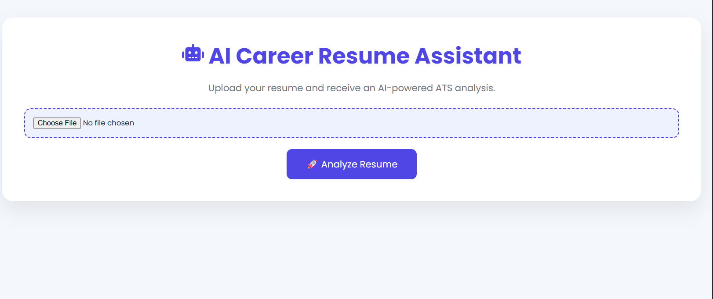
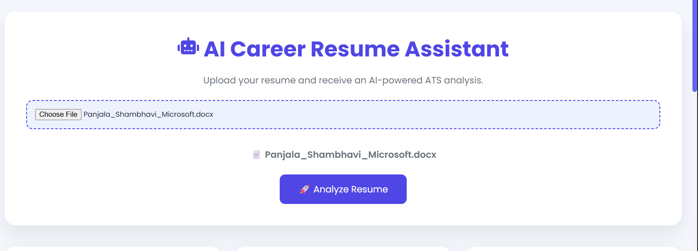
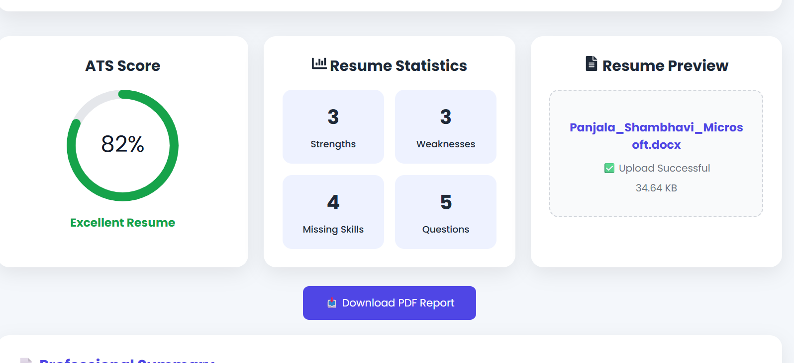
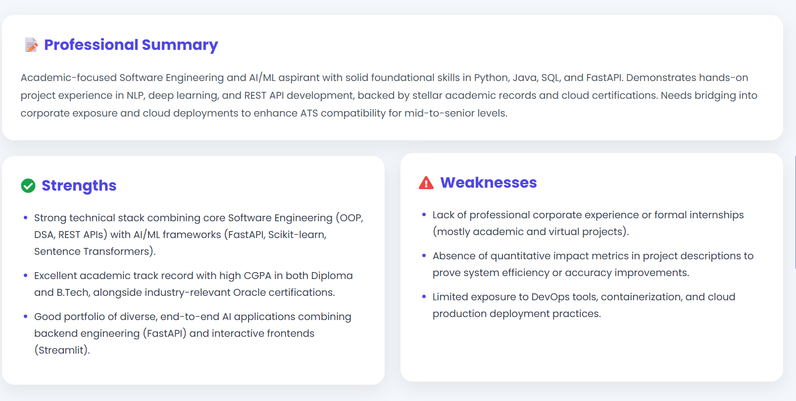
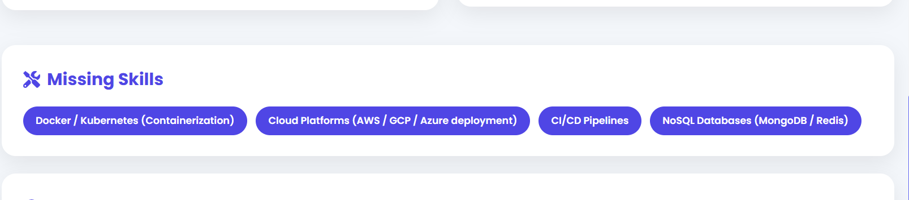
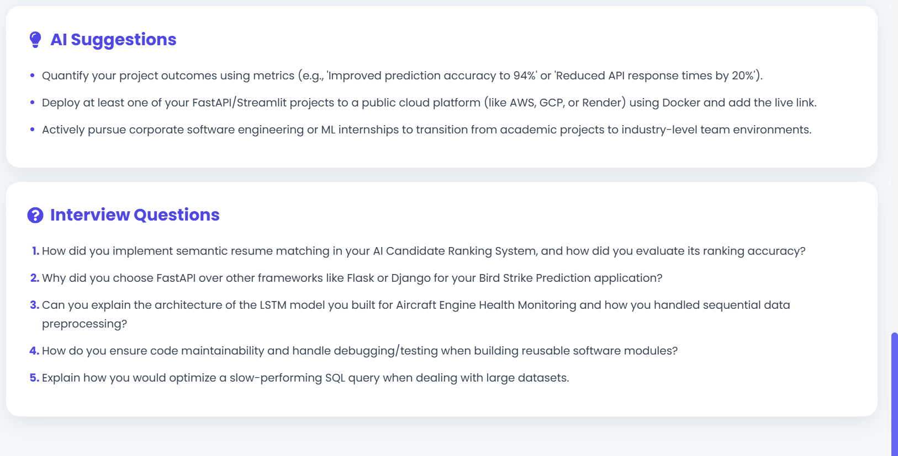
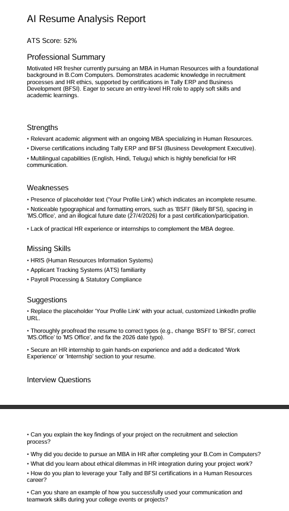

# 🤖 AI Career Resume Assistant

<div align="center">


### AI-powered Resume Analysis Platform using React, FastAPI & Google Gemini

Analyze resumes intelligently with AI-powered ATS scoring, resume insights, skill-gap analysis, personalized suggestions, and interview question generation.

⭐ If you like this project, consider giving it a star!

</div>

---

# 📑 Table of Contents

- Project Overview
- Features
- Technology Stack
- System Architecture
- Workflow
- Project Structure
- Installation
- Environment Variables
- Running the Project
- Screenshots
- API Endpoints
- Future Enhancements
- Author

---

# 🚀 Project Overview

AI Career Resume Assistant is an AI-powered web application that helps students and professionals improve their resumes before applying for internships or jobs.

Instead of manually reviewing resumes, the system leverages **Google Gemini AI** to provide intelligent insights and actionable recommendations within seconds.

After uploading a resume (PDF or DOCX), the application automatically generates:

- ATS Compatibility Score
- Professional Resume Summary
- Resume Strengths
- Resume Weaknesses
- Missing Skills
- Personalized Suggestions
- AI-generated Interview Questions

The project combines **FastAPI**, **React**, and **Google Gemini AI** to deliver an interactive and modern resume analysis experience.

---

# ✨ Features

- 📄 Upload PDF and DOCX resumes
- 🤖 AI-powered resume analysis
- 📊 ATS Score calculation
- 💪 Resume strengths identification
- ⚠️ Weakness detection
- 🎯 Missing skills analysis
- 💡 Personalized improvement suggestions
- 🎤 AI-generated interview questions
- ⚡ Fast API backend
- 🎨 Modern React user interface

---

# 🛠 Technology Stack

## Frontend

- React.js
- Vite
- Tailwind CSS
- Axios

## Backend

- FastAPI
- Python
- Google Gemini API
- PDFPlumber
- Python-docx
- Python-dotenv

---

# 🏗️ System Architecture

```text
                User
                  │
                  ▼
          React Frontend
                  │
                  ▼
          FastAPI Backend
                  │
        Resume Parser
      (PDF / DOCX Files)
                  │
                  ▼
        Google Gemini AI
                  │
                  ▼
     AI Resume Analysis JSON
                  │
                  ▼
        React User Interface
```

---

# 🔄 Application Workflow

```text
Upload Resume
      │
      ▼
Store Resume
      │
      ▼
Extract Resume Text
      │
      ▼
Send Text to Gemini AI
      │
      ▼
Generate AI Analysis
      │
      ▼
Display Results
```

---

# 📂 Project Structure

```text
AI-Career-Resume-Assistant/
│
├── backend/
│   ├── app/
│   │   ├── services/
│   │   │   └── gemini_service.py
│   │   ├── utils/
│   │   │   └── resume_parser.py
│   │   └── main.py
│   │
│   ├── models/
│   ├── routes/
│   ├── services/
│   ├── uploads/
│   ├── requirements.txt
│   ├── .env
│   ├── .env.example
│   ├── package.json
│   └── package-lock.json
│
├── frontend/
│   ├── public/
│   ├── src/
│   │   ├── assets/
│   │   ├── components/
│   │   ├── pages/
│   │   ├── App.jsx
│   │   ├── main.jsx
│   │   └── index.css
│   │
│   ├── package.json
│   ├── package-lock.json
│   └── vite.config.js
│
├── docs/
├── report/
├── screenshots/
│   ├── home-page.png
│   ├── upload-resume.png
│   ├── ats-analysis.png
│   ├── strengths-weaknesses.png
│   ├── missing-skills.png
│   ├── interview-questions.png
│   └── pdf-report.png
│
├── .gitignore
├── package-lock.json
└── README.md
```

---

# ⚙️ Installation

## Clone Repository

```bash
git clone https://github.com/panjalashambhavi/AI-Career-Resume-Assistant.git

cd AI-Career-Resume-Assistant
```

---

## Backend Setup

```bash
cd backend

python -m venv venv

venv\Scripts\activate

pip install -r requirements.txt
```

---

## Frontend Setup

```bash
cd frontend

npm install

npm run dev
```

---

# 🔐 Environment Variables

Create a `.env` file inside the **backend** folder.

```env
GEMINI_API_KEY=YOUR_GEMINI_API_KEY
```

---

# ▶️ Running the Project

## Start Backend

```bash
uvicorn app.main:app --reload
```

Backend URL

```
http://127.0.0.1:8000
```

---

## Start Frontend

```bash
npm run dev
```

Frontend URL

```
http://localhost:5173
```

---

# 📸 Screenshots

## 🏠 Home Page



---

## 📤 Upload Resume



---

## 📊 ATS Analysis



---

## 💪 Strengths & Weaknesses



---

## 🎯 Missing Skills



---

## 🎤 Interview Questions



---

## 📄 PDF Report



---

# 🌐 API Endpoints

| Method | Endpoint | Description |
|----------|-----------|----------------|
| GET | `/` | Backend Health Check |
| POST | `/upload` | Upload Resume and Analyze |

---

# 🔮 Future Enhancements

- User Authentication
- Resume History Dashboard
- Resume Keyword Optimization
- Job Description Matching
- Multi-language Resume Analysis
- Cloud Deployment
- Downloadable AI Reports
- Analytics Dashboard
- Admin Panel

---

# 👩‍💻 Author

## Panjala Shambhavi

AI & Machine Learning Student

GitHub

https://github.com/panjalashambhavi

LinkedIn

https://www.linkedin.com/in/shambhavi-panjala-47265835b

---

# ⭐ Support

If you found this project helpful, please consider giving it a ⭐ on GitHub.

It helps others discover the project and supports my work.

---

# 📄 License

This project is licensed under the MIT License.

Feel free to use, modify, and learn from this project for educational purposes.
